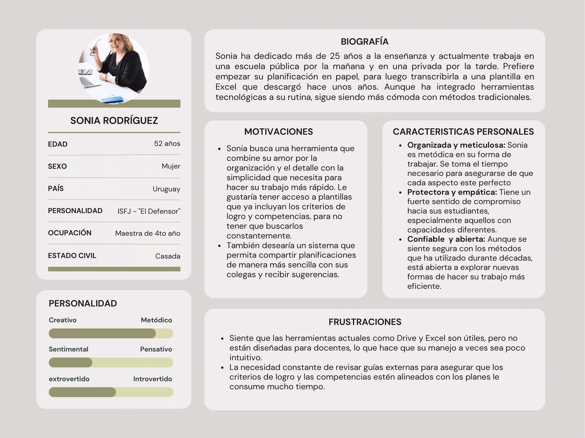
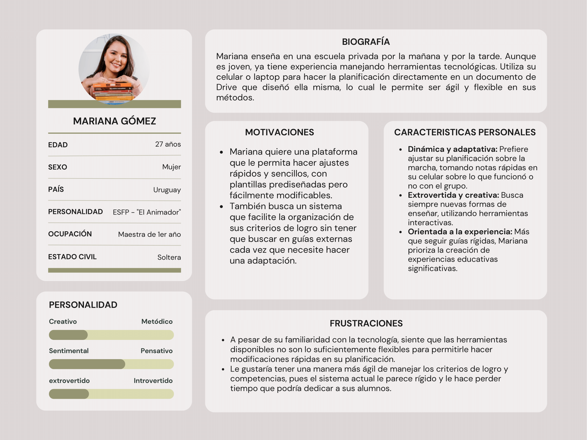

# Informe académico (entrega 1)

## Repositorio Git

Al comienzo de este proyecto se nos asigno un repositorio de git con template para el grupo. Este contenia distintas secciones creadas para facilitar el trabajo y la organizacion en el proyecto.
A medida que fuimos trabajando fuimos creando distintas carpetas y archivos como por ejemplo la carpeta de investigacion donde fuimos recopilando toda la informacion que buscabamos acerca de los temas a tratar en el proyecto y tambien una carpeta para organizar las distintas imagenes del documento.

### Repositorios locales y remotos

Antes de comenzar a involucrarnos directamente en la creación del proyecto, decidimos ponernos de acuerdo con la metodología de desarrollo. Al tener horarios similares entre los integrantes del equipo, concordamos en hacer sesiones de trabajo en las cuales nos conectábamos simultáneamente vía Discord. Luego de comenzar, nos dimos cuenta de que la manera en la que trabajábamos más cómoda y eficientemente era estando cada quien en su repositorio local, pero modificando diferentes partes del documento, y luego de cada cambio significativo, subir la nueva versión al repositorio remoto. De esta manera, podíamos trabajar con libertad y evitar tener conflictos entre versiones y tener decidir cual version seria la definitiva.

### Aplicación de comandos Git

Luego de estar ambos integrantes en el repositorio del proyecto en GitHub, cada quien, en su computadora, creó una nueva carpeta donde estaría el proyecto de manera local. Para poder comenzar a trabajar de manera remota con Git, tuvimos que inicializar la carpeta con el comando "git init", el cual ejecutamos desde la consola Bash al hacer clic derecho en la carpeta y seleccionar "Open Git Bash here". El siguiente paso era clonar el repositorio de GitHub en la carpeta con el comando "git clone 'ruta del repositorio'".

Para este punto, ya teníamos la carpeta inicializada y el repositorio clonado. Cada quien hizo su primer commit de prueba haciendo "git add ." para agregar los cambios realizados al staging y luego un commit con el comando "git commit -m 'mensaje'". Por último, utilizamos el comando "git push -u origin main" para subir los cambios al repositorio y ver si todo había quedado sincronizado correctamente. Como era el primer push que realizábamos, agregamos el comando "-u origin main", el cual asocia la rama local main con la rama remota origin/main. Una vez ambos conectados, entonces pudimos comenzar a trabajar.

Como acuerdo, decidimos que siempre que fuéramos a hacer push lo comentaríamos entre los integrantes. Además, consideramos mejor realizar un push cada vez que termináramos de trabajar por el día. Esto se debió a que, en varias ocasiones, no hacíamos push porque no habíamos terminado alguna parte de la documentación, pero el otro integrante, quien no estaba al tanto, también trabajaba en la misma documentación sin saber que todavía se estaban realizando modificaciones. Si bien existe el merge para este tipo de situaciones, para evitar pérdidas de tiempo, mejoramos la comunicación sobre estos temas y nos pusimos de acuerdo en la frecuencia de los push y pull (una vez al día o cuando los cambios esten validados por todos los integrantes).

## Versionado

Para nosotros, el versionado es uno de los aspectos más importantes en esta primera etapa de desarrollo. Ya que nos permitió tener un registro de los cambios realizados, junto con la fecha de modificación y el usuario que los realizó. Utilizar un sistema como Git, que nos permite mantener un control de las versiones, trae, sin dudas, muchos beneficios. Sin embargo, el más fundamental en nuestro caso ha sido lo fácil y ágil que se volvió la colaboración, además de la posibilidad de revertir cambios, la cual nos salvó de varios inconvenientes.

Generalmente, se recomienda trabajar con cuatro ramas:

- **Rama principal (main)**: Contiene la versión más estable del sistema.
- **Rama de desarrollo (develop)**: Se integran los cambios antes de pasarlos a la rama principal. En esta se trabajan las nuevas funcionalidades.
- **Rama de características (feature branches)**: Se trabajan funcionalidades específicas o mejoras, las cuales, una vez probadas, se integran a la rama develop.
- **Rama de corrección de errores (hotfix branches)**: Su propósito es corregir errores en la versión de producción.

Para los propósitos de este proyecto, especialmente para la primera entrega, dado que considerabamos que era un trabajo bastante lineal y mayormente enfocado en planificación e investigación, al comienzo trabajamos principalmente en la rama main. Pensamos en crear una rama "espacio de trabajo", pero esta resultó entorpecer el ritmo de trabajo, por lo que decidimos eliminarla. Pero mas adelante en el curso, el profesor asignado nos recomendo trabajar en una rama distinta a main como buena practica, y mergear a main para el checkpoint. Por lo tanto a partir de el 01/10/2024 comenzamos a trabajar exclusivamente en la rama "ramaDocumentacion".

### Buenas prácticas de versionado

Existen muchas buenas prácticas asociadas al versionado. Al ser la primera vez que trabajamos con Git para un proyecto, no estábamos acostumbrados al uso de buenas prácticas con esta herramienta. Por lo tanto, las fuimos aprendiendo a medida que aprendíamos más sobre ella.

Algunas de las buenas prácticas que utilizamos fueron:

- Cada commit debía estar relacionado con un único cambio o funcionalidad.
- Los mensajes de los commits debían ser claros y descriptivos.
- Antes de hacer push de cambios importantes, revisamos los cambios en equipo para asegurarnos de que todo esté correcto.
- En el futuro, implementaremos la utilizacion de tags para marcar versiones importantes del proyecto como por ejemplo el chekponint1

### Evolución del proyecto

El proyecto ha pasado por varias etapas a lo largo de su evolución. En su comienzo, al no conocer las tareas que íbamos a realizar, decidimos investigar sobre los temas a tratar en el proyecto. Nos dedicamos a entender la problemática tratada mediante entrevistas a maestras y análisis de la documentación de ANEP, lo que nos preparó para un mejor enfoque a la hora de la creación de los requerimientos del sistema.

Inicialmente, el trabajo era realizado de manera lineal en una única rama main, lo cual nos era más cómodo a los integrantes del equipo. Sin embargo, luego de recibir indicaciones del profesor, decidimos crear una rama Documentacion a partir del 01/10/2024, donde implementaríamos todos los cambios antes de subirlos al main. Este cambio mejoró nuestra organización y facilitó la colaboración, ya que permitía asegurar que la rama main solo tuviera las versiones sin errores.

Una de las principales dificultades que tuvimos fue la gestión de versionado al realizar varios cambios en el documento de manera simultánea. Para poder resolver esto, decidimos realizar commits más pequeños y de manera más frecuente, en vez de subir un único commit al final del día. Esto resultó en mejorar la eficiencia, ya que ambos integrantes trabajábamos siempre en la última versión del proyecto.

Además, otro cambio que realizamos fue en la dinámica de trabajo del equipo, ya que en un comienzo ambos integrantes del equipo desarrollábamos al mismo tiempo, pero debido a dificultades con los horarios, comenzamos a desarrollar cada uno por separado en los momentos que considerábamos oportunos. Sin embargo, en secciones fundamentales del documento, como pueden ser la creación de UIs, la comunicación vía Discord en tiempo real fue fundamental para poder decidir en conjunto y en base a los comentarios realizados por los docentes, un boceto de cómo sería la aplicación desarrollada.

Uno de los eventos claves en la evolución del proyecto fue el Checkpoint 1, donde pudimos tener un feedback del profesor acerca de lo esperado en la documentación, así como algunos aspectos claves que debería cumplir. Por ejemplo, uno de los cambios que realizamos fue la eliminación de palabras genéricas como "sencillo" u "intuitivo", y fuimos más detallados en cada sección, además de marcar las palabras del documento que tuvieran definición en el glosario con un formato específico. También agregamos una conclusión en la sección de entrevistas, ya que antes teníamos un hipervínculo al archivo.

Hasta el momento, hemos logrado identificar y comprender a fondo el problema que enfrentan los docentes al crear planificaciones, así como definir las funciones clave que el sistema debe incorporar para la solución de la problemática de manera efectiva. Con el informe actual, consideramos que tenemos una base sólida que nos permitirá avanzar hacia la siguiente etapa del desarrollo de la página web.

## Glosario

_Todas las palabras que aparecen con este formato a lo largo del documento hacen referencia a que tienen una definicion en el glosario._

### Roles y Conceptos en la Educación

- **Docente**: Persona encargada de enseñar y planificar para uno o más grupos de educación primaria (1.º a 6.º año de escuela). Es el usuario principal del sistema.

- **Director**: Supervisor de los docentes, responsable de ingresar fechas importantes en el calendario mensual. Es el usuario secundario del sistema.
  Un director pertenece a una unica institucion.

- **Grupo**: Conjunto de alumnos que pertenecen a la misma institución y grado, todos asignados a los mismos docentes.

- **Planificación**: Conjunto que incluye: Espacio, Unidad Curricular, Competencia General, Competencia Específica, Contenido Estructural, Criterio de Logro, Metas de Aprendizaje, Planes de Aprendizaje, Recursos, Material Didáctico y Notas. Todo esto se asocia a un grupo específico.

- **Material Didáctico**: Recursos en formato PDF o imagen que se utilizan como actividades para los alumnos de un grupo.

- **Institución Educativa**: El lugar donde trabaja el docente, que tiene un solo director.

- **Semana**: Comprende cinco días de lunes a viernes.

- **Día**: Período de trabajo generalmente de 4 a 8 horas.

- **Planificación Semanal**: Planificación estructurada en un bloque de 5 días continuos, de lunes a viernes.

- **Planificación Quincenal**: Planificación organizada en 3 bloques continuos de 5 días cada uno, todos de lunes a viernes.

- **Espacio**: Áreas generales del tema que se abordarán en un día, que incluyen: Comunicación, Científico-Matemático, Ciencias Sociales y Humanidades, Creativo-Artístico, y Desarrollo Personal y de Conciencia Corporal.

- **Unidad Curricular**: Materia específica de conocimiento, como Matemáticas, Lengua y Literatura, Ciencias Sociales, Ciencias Naturales, Educación Física y Arte.

- **Competencia General**: Clasificación de tipos de conocimiento que incluye: Comunicación, Pensamiento Crítico, Pensamiento Creativo, Pensamiento Científico, Pensamiento Computacional, Metacognición, Educación en Valores y Ciudadanía, y Desarrollo Personal y Social.

- **Competencia Específica**: Criterios que indican el avance esperado, que varían según el espacio, denotándose como CEi (donde i es un número entre 1 y n).

- **Contenido Estructural**: Aspectos fundamentales del área de conocimiento. Por ejemplo, en Matemáticas, la suma.

- **Criterio de Logro**: Objetivo principal que se busca alcanzar en el día planificado.

- **Meta de Aprendizaje**: Actividades que se espera que los alumnos realicen durante el día.

- **Plan de Aprendizaje**: Estrategia que se seguirá para alcanzar la meta de aprendizaje.

- **Recursos**: Materiales utilizados por el docente para planificar la clase y el material didáctico.

- **Metodología Activa**: Método empleado para lograr el criterio de logro y la meta de aprendizaje. Su uso es opcional.

- **Calendario Mensual**: Calendario que muestra únicamente los días de lunes a viernes de un mes.

- **Feriado**: Día sin clases, por lo cual no se realiza planificación.

- **Programa EBI**: Criterios de planificación proporcionados por la ANEP para guiar a los docentes en la enseñanza.

- **Futuro Consumidor**: Término que se refiere a docentes y directores.

- **Prioridad alta**: Indica que ese requerimiento es fundamental para la pagina web

- **Prioridad media**: Indica que ese requerimiento le aprotaria mucho valor a la pagina web.

- **Prioridad baja**: Indica que ese requerimiento seria una buena implementacion pero no necesaria.

## Elicitación

### Evidencia de actividades de investigación

- **Entrevistas a usuarios potenciales**:
  - [Clic para ver preguntas de entrevistas con doncentes](/docs/investigacion/preguntas-docentes.md)
- **Documentacion de Entrevistas realizadas**:

  - [Click para ver Documentacion de entrevistas](/docs/investigacion/entrevistas.md) . _Entrevistas realizadas el 24/09/2024 Presencial._

    #### Conclusiones de entrevistas:

    - Nelly:

      - Maestra de 3er año. Entre 40 y 60 años.
      - Le seria util poder realizar anotaciones sobre niños con capacidades diferentes para adaptar la _planificación_ a sus necesidades. - Menciona la falta de plantillas o guías proporcionadas por ANEP y expresa la necesidad de una herramienta más accesible y sencilla, que no requiera tanto ir y volver a las guías para agregar _criterios de logro_ o competencias específicas.

    - Fernanda:

      - Maestra de 5to año. Entre 40 y 60 años.
      - Poder realizar una agenda donde anotar las actividades que tienen para cualquier día de esa _semana_, como por ejemplo orales o presentaciones de proyectos le seria muy util.

      - Existen proyectos colaborativos entre maestras. Por ejemplo, si ella realiza una planificacion sobre un tema, seguramente haya algún otro _docente_ que también tenga una temática similar paralela a ella. Conociendo esto, seria util poder planificar actividades didácticas intergrupales.

    - Lucía:

      - Maestra de 1er año. Entre 20 y 30 años.
      - Suele colocar _criterios de logro_ por _semana_.
      - Tiene una documento donde realiza observaciones donde comenta si llegó o no a dar los temas.
      - También comparte su _planificación_ con la inspectora/_directora_ mediante Drive.

    - Elena:
      - Maestra de 2do año. Entre 30 y 40 años.
      - Le gustaría tener un checklist de "to-do" para temas que quisiera tratar con un _grupo_ en particular.
      - Cree que sería conveniente tener alguna herramienta para relacionar cosas más rápido. Comenta que la mayoría de las maestras eligen primero el criterio a abordar y luego lo asocian a la _competencia específica_ y el _criterio de logro_, lo cual consume mucho tiempo.

  - Entrevistas de validacion _Realizadas el 18/10/2024 Presencial._ Su documentación se encuentra en la seccion de validacion. Participan: Nelly y Fernanda.

- **Analisis de Documentacion Oficial**:
  - [Click para ver Documentacion Asociada a ANEP](/docs/investigacion/programas_EBI.md).

### Referencias a fuentes de información

- Visuresolutions
- Anep.edu.uy
- Libro "Ingeniería de software" 9.ª edición Capítulo 4
- ChatGPT (Para correcciones ortograficas y gramaticales)
- Canva

### Caracterización de usuarios

Para caracterizar los usuarios decidimos hacer 2 user persona. Cada uno engloba a los _docentes_ entrevistados segun su rango etario.

#### Sonia Rodriguez

#### Mariana Gomez

### Modelo conceptual del problema

## Especificación

### Requerimientos funcionales y no funcionales

### Funcionales

#### 📅 1. Posibilidad de creación de planes

- **Prioridad**: _Alta_  
  Dentro de la sección _Planificación_ de Clases, los _docentes_ deben poder crear una nueva _planificación_ _semanal_ o _quincenal_. Al crear la _planificación_, se debe especificar la fecha del comienzo de la _semana_ y el _grupo_ asociado a esa planificación. Los _docentes_ podrán editar cada día individualmente y agregar todo lo incluido en una _planificación_. Las ediciones deben ser guardadas mediante un botón "guardar".

#### 👥 2. Crear nuevos grupos

- **Prioridad**: _Alta_  
  Dentro de la sección _Grupos_ debe ser posible agregar nuevos _grupos_, o eliminar _grupos_. Cuando se agrega un _grupo_ se debe indicar grado, institución educativa, Nombre (Opcional) y cantidad de alumnos (Opcional). Cuando se elimina un _grupo_ se elimina toda la información asociada al mismo, incluyendo planificaciones asociadas.

#### 📆 3. Posibilidad de anotación de fechas en el calendario

- **Prioridad**: _Media_  
  Dentro de la sección Calendario, debe aparecer un calendario mensual y dos botones para avanzar o retroceder el mes. En el calendario, se debe poder hacer clic sobre un día específico, permitiendo poner notas con: nombre, descripción y color. Al seleccionar el color, la casilla del día se debe poner de ese color.

#### 📚 4. Posibilidad de agregar material didáctico

- **Prioridad**: _Media_  
  Dentro de la sección _Material Didáctico_, el _docente_ debe ser capaz de subir archivos de tipo PDF o imagen, y deben quedar almacenados. Se debe poder crear carpetas y agregarles nombres.

#### 🗺️ 5. Menú de navegación

- **Prioridad**: _Alta_  
  Dentro de la página debe haber un menú de navegación con las opciones: _Grupos_, _Planificación_ de Clases, Calendario, _Material Didáctico_, Perfil y Configuración. Este menú debe ser accesible desde todas las pestañas del sistema, debe tener un diseño minimalista y un ícono representativo.

### No funcionales

#### 📱 1. Adaptabilidad

- **Prioridad**: _Alta_  
  La página debe poder ser utilizada en cualquier dispositivo Windows superior a Windows 7, cualquier Android superior a la versión 7.0 y para cualquier iOS superior a iOS 15.

#### 🎨 2. Diseño

- **Prioridad**: _Media_  
  La página debe tener un diseño minimalista que priorice la claridad y la usabilidad, evitando la sobrecarga visual en la pantalla con elementos llamativos como imágenes o cuadros con colores fuertes. Todos los elementos de la interfaz deben ser discretos; por ejemplo, un texto debe tener el formato "Arial" color negro y fondo blanco, para fomentar la legibilidad.

#### 🌙 3. Modo oscuro

- **Prioridad**: _Baja_  
  La página debe tener la opción de alternar entre modo claro u oscuro. Al alternar de modo, el texto y las estructuras, como las planificaciones o el calendario, deben seguir siendo legibles. Esta opción debe estar en la sección de configuración.

#### ⚡ 4. Rendimiento

- **Prioridad**: _Media_  
  La navegación por el menú y las interacciones en la página no deben ser lentas. Todas las acciones deben completarse en menos de 2 segundos para garantizar una experiencia cómoda dentro de la página.

#### 🔒 5. Privacidad de planificaciones

- **Prioridad**: _Media_  
  Las planificaciones de los _docentes_ deben ser privadas y accesibles únicamente por el _docente_ que las creó. El sistema debe garantizar que ningún otro _docente_ pueda acceder o visualizar las planificaciones a menos que se les otorgue permiso explícito por parte del propietario.

### User stories

#### 📚 Planificación de clases

**Como** _docente_  
**Quiero** poder crear una _planificación_ _semanal_ o _quincenal_ para mis clases  
**Para** organizar los temas y actividades con anticipación.

**Criterios de aceptación:**

- La _planificación_ debe permitir asignar fechas y temas por _grupo_.
- Debe existir una opción para guardar la _planificación_ y editarla en el futuro.

#### 🗓️ Calendario compartido

**Como** _director_  
**Quiero** poder agregar fechas importantes como pruebas y _feriados_ en un calendario  
**Para** que todos los _docentes_ estén informados.

**Criterios de aceptación:**

- El calendario debe permitir marcar fechas con etiquetas.
- Las entradas del calendario deben ser visibles para _director_ y _docentes_ de la misma institución.

#### 👥 Gestión de grupos

**Como** _docente_  
**Quiero** crear _grupo_  
**Para** organizar planificaciones según mis _grupos_ asignados.

**Criterios de aceptación:**

- Debe permitir la creación y eliminación de _grupos_.

#### 📁 Repositorio de materiales

**Como** _docente_  
**Quiero** subir y organizar materiales didácticos  
**Para** tener fácil acceso a ellos y compartirlos con otros _docentes_.

**Criterios de aceptación:**

- El sistema debe permitir subir archivos en formato PDF o imagen.
- Debe existir una opción para compartir materiales con los _docentes_.

#### 📅 Vista del calendario

**Como** _docente_  
**Quiero** visualizar un calendario mensual con eventos importantes  
**Para** organizar mejor mi _planificación_.

**Criterios de aceptación:**

- El calendario debe mostrar las fechas importantes.
- Las vistas deben ser configurables entre _semanal_ y mensual.

#### 🔗 Compartir planificaciones

**Como** _docente_  
**Quiero** compartir mis planificaciones con otros _docentes_  
**Para** colaborar y compartir el progreso de mi _planificación_.

**Criterios de aceptación:**

- Debe existir una opción para compartir la _planificación_ con otros usuarios registrados.

### Use cases

#### 📚 Agregar Planificación

|                                                                                    |                                                                                                                                                                                                           |
| ---------------------------------------------------------------------------------- | --------------------------------------------------------------------------------------------------------------------------------------------------------------------------------------------------------- |
| **Título**: Agregar Planificación                                                  |                                                                                                                                                                                                           |
| **Actor**: Docente                                                                 |                                                                                                                                                                                                           |
| **Precondición**: El docente ha iniciado sesión en el sistema.                     |
| **Acción del actor**                                                               | **Respuesta del sistema**                                                                                                                                                                                 |
| 1. El docente selecciona la opción "Planificación de Clases" en el menú principal. | 2. El sistema muestra la página de "Planificación de Clases", con un botón para "Agregar nueva planificación" y una lista de planificaciones previas.                                                     |
| 3. El docente hace clic en "Agregar nueva planificación".                          | 4. El sistema despliega un formulario con una lista para seleccionar un grupo y dos opciones de planificación: "Semanal" o "Quincenal", seguido de un botón "Crear".                                      |
| 5. El docente selecciona un grupo de la lista y elige la opción "Semanal".         | 6. El sistema muestra cinco casillas correspondientes a los días de la semana, de lunes a viernes.                                                                                                        |
| 7. El docente hace clic en una de las casillas de los días de la semana.           | 8. El sistema despliega un cuadro de texto donde el docente puede escribir las notas para ese día.                                                                                                        |
| **Curso alternativo**                                                              | **Respuesta del sistema**                                                                                                                                                                                 |
| 5.1. Si no hay grupos disponibles en la lista.                                     | El sistema muestra un mensaje que indica: "Debe agregar un grupo antes de realizar una planificación".                                                                                                    |
| 5.2. Si el docente selecciona la opción "Quincenal" en lugar de "Semanal".         | El sistema muestra un calendario con tres semanas, cada una con cinco casillas correspondientes a los días de la semana, de lunes a viernes, para que el docente agregue la planificación de cada semana. |

#### 👥 Agregar Grupo

|                                                                            |                                                                                                                                                                    |
| -------------------------------------------------------------------------- | ------------------------------------------------------------------------------------------------------------------------------------------------------------------ |
| **Título**: Agregar Grupo                                                  |                                                                                                                                                                    |
| **Actor**: Docente                                                         |                                                                                                                                                                    |
| **Precondición**: El docente ha iniciado sesión en el sistema.             |
| **Acción del actor**                                                       | **Respuesta del sistema**                                                                                                                                          |
| 1. El docente selecciona la opción "Grupos" en el menú principal.          | 2. El sistema muestra la página de "Grupos", con un botón para "Agregar nuevo grupo" y una lista de los grupos existentes del docente.                             |
| 3. El docente hace clic en "Agregar nuevo grupo".                          | 4. El sistema despliega un formulario con cuatro campos: "Nombre del Grupo", "Grado", "Institución educativa" y "Cantidad de alumnos", junto con un botón "Crear". |
| 5. El docente rellena los campos y hace clic en "Crear".                   | 6. El sistema añade el nuevo grupo a la lista y muestra la información del grupo creado.                                                                           |
| **Curso alternativo**                                                      | **Respuesta del sistema**                                                                                                                                          |
| 3.1. Los datos ingresados son incorrectos.                                 | El sistema muestra un mensaje que indica: "Datos incorrectos".                                                                                                     |
| 5.1. Si los campos "Grado" o "Institución educativa" no están completados. | El sistema resalta las casillas incompletas y muestra un mensaje de error: "Campos obligatorios".                                                                  |

#### 🗓️ Agregar Fecha en Calendario

|                                                                        |                                                                                                                                   |
| ---------------------------------------------------------------------- | --------------------------------------------------------------------------------------------------------------------------------- |
| **Título**: Agregar Fecha en Calendario                                |                                                                                                                                   |
| **Actor**: Director                                                    |                                                                                                                                   |
| **Precondición**: El director ha iniciado sesión en el sistema.        |
| **Acción del actor**                                                   | **Respuesta del sistema**                                                                                                         |
| 1. El director selecciona la opción "Calendario" en el menú principal. | 2. El sistema muestra un calendario mensual con dos botones para avanzar o retroceder el mes.                                     |
| 3. El director hace clic en un día específico del calendario.          | 4. El sistema despliega un formulario con los campos "Nombre", "Descripción" y "Color", junto con un botón para guardar la fecha. |
| 5. El director rellena los campos y selecciona un color.               | 6. El sistema guarda la fecha y cambia el color de la casilla del día seleccionado al color indicado.                             |
| **Curso alternativo**                                                  | **Respuesta del sistema**                                                                                                         |
| 5.1. Si algún campo obligatorio no está completado.                    | El sistema resalta los campos incompletos y muestra un mensaje de error: "Campos obligatorios".                                   |

#### 📁 Agregar Material Didáctico

|                                                                               |                                                                                                                                             |
| ----------------------------------------------------------------------------- | ------------------------------------------------------------------------------------------------------------------------------------------- |
| **Título**: Agregar Material Didáctico                                        |                                                                                                                                             |
| **Actor**: Docente                                                            |                                                                                                                                             |
| **Precondición**: El docente ha iniciado sesión en el sistema.                |
| **Acción del actor**                                                          | **Respuesta del sistema**                                                                                                                   |
| 1. El docente selecciona la opción "Material Didáctico" en el menú principal. | 2. El sistema muestra la página de "Material Didáctico", con una lista de archivos y carpetas, y un botón para "Agregar Material".          |
| 3. El docente hace clic en "Agregar Material".                                | 4. El sistema despliega una ventana que permite subir archivos con la opción de seleccionar un archivo en formato PDF o imagen (PNG o JPG). |
| 5. El docente selecciona un archivo y lo sube.                                | 6. El sistema confirma la subida del archivo y lo añade a la lista de material didáctico.                                                   |
| 7. El docente hace clic en "Crear carpeta" para organizar los archivos.       | 8. El sistema muestra una opción para introducir el nombre de la carpeta.                                                                   |
| 9. El docente introduce el nombre de la carpeta y la crea.                    | 10. El sistema crea la carpeta con el nombre indicado y permite arrastrar archivos dentro de ella.                                          |
| **Curso alternativo**                                                         | **Respuesta del sistema**                                                                                                                   |
| 5.1. Si el archivo no es en formato PDF, PNG o JPG.                           | El sistema muestra un mensaje de error: "Formato no permitido. Solo se aceptan archivos PDF, PNG o JPG".                                    |
| 9.1. Si el nombre de la carpeta ya existe.                                    | El sistema muestra un mensaje de error: "Nombre de carpeta ya existente".                                                                   |

#### 📅 Ver Eventos en Calendario

|                                                                                                                   |                                                                                                                                                                                                |
| ----------------------------------------------------------------------------------------------------------------- | ---------------------------------------------------------------------------------------------------------------------------------------------------------------------------------------------- |
| **Título**: Ver Eventos en Calendario                                                                             |                                                                                                                                                                                                |
| **Actor**: Docente                                                                                                |                                                                                                                                                                                                |
| **Precondición**: El docente ha iniciado sesión en el sistema y pertenece a la misma institución que el director. |
| **Acción del actor**                                                                                              | **Respuesta del sistema**                                                                                                                                                                      |
| 1. El docente selecciona la opción "Calendario" en el menú principal.                                             | 2. El sistema muestra la página del calendario con la vista mensual, junto con botones para avanzar o retroceder meses.                                                                        |
| 3. El docente hace clic en un día específico en el calendario.                                                    | 4. El sistema despliega un cuadro de texto debajo del calendario que muestra toda la información de las actividades programadas para ese día, incluyendo nombre, descripción y color asignado. |
| **Curso alternativo**                                                                                             | **Respuesta del sistema**                                                                                                                                                                      |
| 3.1. Si no hay eventos programados para el día seleccionado.                                                      | El sistema muestra el mensaje: "No hay eventos programados para este día".                                                                                                                     |

### Bocetos de IU

**UI Menu**

**UI Crear Planificacion De Clases**

**UI Ver Planificacion De Clases**

**UI Grupos**

**UI Calendario**

## Checkpoint obligatorio 1

Hasta el momento del checkpoint, avanzamos considerablemente en la elicitación y la especificación de requerimientos. Para la elicitación utilizamos varias técnicas para identificar las necesidades de las _docentes_ y del sistema. Entre estas destacan las entrevistas realizadas el 24/09/2024, que nos dieron un panorama acerca de la realidad de la _planificación_ por parte de las _docentes_, así como ideas para el futuro sistema. También realizamos una investigación de los programas de la ANEP para comprender las normas que deben seguir los _docentes_ a la hora de realizar una _planificación_, todo para poder tener una mejor visión de la problemática a tratar.

En cuanto a la especificación de requerimientos, comenzamos realizando una investigación para comprender de mejor manera a qué se refiere el término, y luego pasamos a definir algunos requerimientos funcionales y no funcionales del sistema. Los funcionales son en su mayoría funciones clave para el funcionamiento del sistema, como la creación de planificaciones o la creación de _grupos_, mientras que los no funcionales se centraron en aspectos sobre el diseño o la privacidad de los usuarios.

También para este primer checkpoint desarrollamos user stories y un caso de uso detallado que describe uno de los funcionamientos principales del sistema, lo que nos permite comprender mejor cómo será el futuro funcionamiento del mismo. Además, construimos un modelo conceptual sobre como realizan las planificaiones los _docentes_, la cual nos ayuda a entender las distintas partes de la problematica y como se relacionan entre si.

En resumen, hasta este punto pudimos definir las necesidades principales de los _docentes_ y documentar los requerimientos esenciales del sistema, que lograrán cumplir estas necesidades, teniendo así una base sólida para continuar con el desarrollo del sistema.

## Validación y verificación

### Verificación

Para la verificacion de los requerimientos usamos el checklist que se nos presento en aulas:

- Completitud

  1. ¿Se encuentran todos los requerimientos correctamente priorizados?
  2. ¿Son todas las clases de usuarios identificados y sus características descriptas?
  3. ¿Respeta la especificación la estructura y apartados del estándar?
  4. ¿Se identifican y describen las dependencias con otros sistemas?
  5. ¿Están todas las características de calidad tenidas en cuenta en la especificación?

- Verificabilidad y no ambigüedad

  1. ¿Tiene cada requerimiento una única interpretación?
  2. ¿Puede ser cada requerimiento verificado por alguna prueba, demonstración, revisión o análisis?

- Correctitud y consistencia

  1. ¿Están los requerimientos escritos en forma consistente y a un nivel de detalle adecuado?
  2. ¿Existe duplicación de requerimientos o conflicto entre requerimientos?
  3. ¿Está cada requerimiento dentro del alcance del problema a resolver?
  4. ¿Evitan los requerimientos incluir aspectos de diseño o implementación de la solución?

- Trazabilidad

  1. ¿Puede cada requerimiento ser identificado correctamente y en forma única?
  2. ¿Se referencian correctamente los requerimientos entre sí?
  3. ¿Puede cada requerimiento ser referenciado hasta su origen (alguna necesidad de los stakeholders)?

#### Verificacion de requerimientos funcionales:

|                                   | 📅 1 | 👥 2 | 📆 3 | 📚 4 | 🗺️ 5 |
| :-------------------------------- | :--: | :--: | :--: | :--: | :--: |
| Completitud 1                     |  SI  |  SI  |  SI  |  NO  |  SI  |
| Completitud 2                     |  SI  |  NO  |  NO  |  SI  |  NO  |
| Completitud 3                     |  SI  |  SI  |  SI  |  SI  |  SI  |
| Completitud 4                     |  NO  |  SI  |  SI  |  SI  |  SI  |
| Completitud 5                     |  SI  |  SI  |  SI  |  SI  |  SI  |
| Verificabilidad y No ambigüedad 1 |  SI  |  SI  |  SI  |  SI  |  SI  |
| Verificabilidad y No ambigüedad 2 |  SI  |  SI  |  SI  |  SI  |  SI  |
| Correctitud y Consistencia 1      |  SI  |  SI  |  SI  |  SI  |  SI  |
| Correctitud y Consistencia 2      |  NO  |  NO  |  NO  |  NO  |  NO  |
| Correctitud y Consistencia 3      |  SI  |  SI  |  NO  |  NO  |  SI  |
| Correctitud y Consistencia 4      |  NO  |  NO  |  SI  |  SI  |  NO  |
| Trazabilidad 1                    |  SI  |  SI  |  SI  |  SI  |  SI  |
| Trazabilidad 2                    |  NO  |  SI  |  SI  |  SI  |  SI  |
| Trazabilidad 3                    |  NO  |  SI  |  SI  |  SI  |  SI  |

#### Verificacion de requerimientos no funcionales:

|                                   | 📱 1 | 🎨 2 | 🌙 3 | ⚡ 4 | 🔒 5 |
| :-------------------------------- | :--: | :--: | :--: | :--: | :--: |
| Completitud 1                     |  SI  |  SI  |  SI  |  SI  |  SI  |
| Completitud 2                     |  NO  |  NO  |  NO  |  NO  |  SI  |
| Completitud 3                     |  SI  |  SI  |  SI  |  SI  |  SI  |
| Completitud 4                     |  SI  |  NO  |  NO  |  NO  |  NO  |
| Completitud 5                     |  SI  |  SI  |  SI  |  SI  |  SI  |
| Verificabilidad y No ambigüedad 1 |  SI  |  NO  |  NO  |  SI  |  SI  |
| Verificabilidad y No ambigüedad 2 |  SI  |  SI  |  SI  |  SI  |  SI  |
| Correctitud y Consistencia 1      |  SI  |  SI  |  SI  |  SI  |  SI  |
| Correctitud y Consistencia 2      |  NO  |  NO  |  NO  |  NO  |  NO  |
| Correctitud y Consistencia 3      |  SI  |  SI  |  NO  |  SI  |  NO  |
| Correctitud y Consistencia 4      |  NO  |  NO  |  NO  |  NO  |  NO  |
| Trazabilidad 1                    |  SI  |  SI  |  SI  |  SI  |  SI  |
| Trazabilidad 2                    |  NO  |  NO  |  SI  |  NO  |  SI  |
| Trazabilidad 3                    |  NO  |  NO  |  NO  |  NO  |  SI  |

Para la verificacion de casos de uso usamos el checklist proporcionado por aulas:

1. ¿Cumple el caso de uso un único objetivo o tarea?
2. ¿Es su objetivo un resultado medible para el usuario?
3. ¿Queda claro que actor(es) participan y benefician del caso de uso?
4. ¿Existe una secuencia lógica en los pasos que permita entender la transacción entre actor y sistema?
5. ¿Es el nivel de abstracción de las transacciones adecuado para el caso de uso?
6. ¿Está el caso de uso libre de detalles de diseño e implementación de posibles soluciones?
7. ¿Se documentan todos los posibles cursos alternativos?
8. ¿Existen pre y pos condiciones que contextualicen correctamente el caso de uso?

#### Verificacion de casos de uso:

|     |   📚 Agregar planificación   |       👥 Agregar Grupo       | 🗓️ Agregar Fecha en Calendario | 📁 Agregar Material Didactico | 📅 Ver eventos en Calendario |
| :-- | :--------------------------: | :--------------------------: | :----------------------------: | :---------------------------: | :--------------------------: |
| 1   |              SI              |              SI              |               SI               |              SI               |              SI              |
| 2   |              SI              |              SI              |               SI               |              SI               |              SI              |
| 3   |              SI              |              SI              |               SI               |              SI               |              SI              |
| 4   |              SI              |              SI              |               SI               |              SI               |              SI              |
| 5   |              SI              |              SI              |               SI               |              SI               |              SI              |
| 6   |              NO              |              NO              |               NO               |              NO               |              NO              |
| 7   |              SI              |              SI              |               SI               |              SI               |              SI              |
| 8   | SI PRE PERO NO POS CONDICIÓN | SI PRE PERO NO POS CONDICIÓN |  SI PRE PERO NO POS CONDICIÓN  | SI PRE PERO NO POS CONDICIÓN  | SI PRE PERO NO POS CONDICIÓN |

### Validación

Para la etapa de _Validación_, volvimos a contactar con las _docentes_ que entrevistamos. Organizamos la reunión con poca anticipación, por lo que solo estuvieron presentes dos de ellas. Debido a que eran pocas, decidimos hacer una reunión grupal para discutir en conjunto el avance del proyecto. La modalidad fue la siguiente:

- Previamente, preparamos una serie de bocetos muy básicos de UI.
- Listamos los _Requisitos Funcionales_, para luego presentárselos y que pudieran hacernos comentarios al respecto.
- Llevamos una hoja de papel para poder plasmar sus ideas y cambios junto con ellas.

#### _Feedback_ sobre bocetos UI:

Los bocetos UI presentados fueron:

- **Bocetos _Inicio_**:

  1.  
  2.  

- **Bocetos _Planificación_**:
  1.  
  2.  
- **Boceto _Grupo_**:  
  
- **Boceto _Calendario_**:  
  

Resultados de reunión:

- A las _docentes_ se les hizo más claro tener la barra de navegación en la parte superior de la página.
- Les gustaría que en el _Inicio_ hubiera una descripción de lo que se puede hacer en la página.
- Quitar sección de _Material Didáctico_.
- En el listado de _Grupos_, poder filtrarlos por _Institución_ o _Grado_.
- Poder decir la cantidad de alumnos que tiene un _Grupo_.
- Prefirieron que se pueda seleccionar la _Planificación_ de un _Día_ en lugar de que se muestre la de los 5 días simultáneamente.
- En lugar de una barra desplegable para elegir un _Grupo_, les gustaría que los listara y poder elegir de ahí.
- Tener una opción que sea solo estar en modo espectador en la _Planificación_, para evitar editar cosas sin quererlo.
- Que en lugar de agregar una _Planificacion_ a un dia especifico, esten los dias de la semana de manera predeterminada y se realizen _planificaciones_ sobre ellos.
- Las docentes concuerdan que la seccion de _Calendario_ les seria util.

**Boceto resultante:**

Con este feedback logramos realizar un boceto más acorde a lo esperado, el cual se encuentra en el Boceto UI.

#### _Feedback_ sobre requisitos:

Los _Requisitos_ presentados a las docentes son los que se encuentran en la sección de _Requisitos Funcionales_.
Para los mismos la unica modificacion que las docentes propusieron fue la eliminacion del requisito "Posibilidad de agregar material didáctico" ya que segun ellas resultaría tedioso tener que subir todo el material y prefieren seguir guardándolo en Drive.

## Reflexión

### Detalle del trabajo individual

|     Responsable      | Actividad                                                                                                            | Tiempo         |
| :------------------: | :------------------------------------------------------------------------------------------------------------------- | -------------- |
| Salvador, Valentina  | Creacion de preguntas para la entrevista a docentes                                                                  | 40 min         |
|       Salvador       | Investigación y creacion de archivo "especificacion-requisitos.md" y "template-SRC.md"                               | 1 hora 20 min  |
|      Valentina       | Investigación y creacion de archivo "programas_EBI.md"                                                               | 1 hora 30 min  |
|       Salvador       | Investigación y creacion de archivo "requerimientos.md"                                                              | 1 hora         |
|      Valentina       | Entrevistas a docentes                                                                                               | 3 horas 40 min |
|       Salvador       | Creacion de Requrimientos funcionales y no funcionales                                                               | 2 horas 40 min |
|       Salvador       | Creacion de Caso de uso "Agregar grupo"                                                                              | 1 hora 20 min  |
|      Valentina       | Creacion de User Persona "Sonia Rodriguez" y "Mariana Gomez"                                                         | 1 hora         |
| Salvador y Valentina | Creacion de user stories                                                                                             | 1 hora         |
| Salvador y Valentina | Creacion del modelo conceptual del problema                                                                          | 1 hora 20 min  |
|       Salvador       | Checkpoint Obligartorio 1                                                                                            | 40 min         |
|      Valentina       | Glosario                                                                                                             | 50 min         |
|       Salvador       | Creacion de Caso de uso "Agregar Planificacion"                                                                      | 50 min         |
|       Salvador       | Correcciones del documento: errores ortograficos, subrayado de palabras glosario y correccion en seccion entrevistas | 40 min         |
|      Valentina       | Creacion de Caso de uso "Agregar Fecha en Calendario"                                                                | 15 min         |
|      Valentina       | Creacion de Caso de uso "Agregar Material Didactico"                                                                 | 15 min         |
|      Valentina       | Creacion de Caso de uso "Ver Evento en Calendario"                                                                   | 10 min         |
|      Valentina       | Cambio subrayado por cursiva, agrego emojis a titulos para mejorar estetica                                          | 10 min         |
| Salvador y Valentina | Diseño de bocetos de UI primera version                                                                              | 1 hora 20 min  |
|       Salvador       | Diseño de UIs en Canva                                                                                               | 1 hora 20 min  |
|       Salvador       | Seccion Evolucion del Proyecto                                                                                       | 1 hora         |
|      Valentina       | Completo Verificacion de Requisitos y Casos de uso                                                                   | 40 min         |
|      Valentina       | Entrevista de validacion de Requisitos y UI                                                                          | 1 hora         |
|      Valentina       | Completo validacion con informacion de entrevistas                                                                   | 20 min         |

---

### Técnicas aplicadas y aprendizajes

Para todo lo relacionado con la investigación, tratamos de hacer uso de la mayor cantidad de recursos disponibles para poder acercarnos al problema propuesto de la manera más acertada posible. Algunas de las técnicas utilizadas fueron:

- **Análisis de documentación oficial**: Esta técnica fue la más predominante, sobre todo en las primeras etapas. Realizamos una revisión de los documentos oficiales relacionados con la ANEP y la educación existentes en internet, como los programas _EBI_.

- **Investigación en fuentes bibliográficas**: Si bien para la problemática de la _planificación_ _semanal_ no existe bibliografía relacionada (o al menos no encontramos), debimos consultar fuentes de este tipo para comprender mejor aspectos del proyecto, como la especificación de requerimientos o incluso funcionalidades de Git.

- **Investigación en Internet**: Al no encontrar bibliografia relacionada, recurrimos a internet para algunos temas que no nos quedaron tan claros.

- **Entrevistas a usuarios potenciales**: Desde el comienzo, estuvimos de acuerdo en que la problemática requiere trabajo de campo. Por lo tanto, siempre consideramos las entrevistas a doncentes como una parte fundamental en esta primera etapa. Esta técnica es muy enriquecedora en cuanto a la cantidad de información relevante que nos aporta; nos permite acercarnos al problema de una manera en que podemos comprender tanto sus necesidades actuales como las expectativas hacia un sistema que podría tener su futuro consumidor. Consideramos que ni siquiera la inteligencia artificial puede proporcionarnos de manera tan precisa la información que nos brindan las personas que experimentan esta problemática en su día a día.

También consideramos la realización de encuestas como un posible acercamiento al problema, pero al haber realizado entrevistas, obtuvimos toda la información necesaria de las mismas, por lo que descartamos la idea de las encuestas.

### Investigacion asociada a creacion de informe:

- **Investigación en fuentes bibliográficas e internet**:
  - [Click para ver investigacion sobre especificacion de requisitos (como hacerlos) ](/docs/investigacion/especificacion-requisitos.md)
  - [Click para ver investigacion sobre requerimientos (como hacerlos) ](/docs/investigacion/requerimientos.md)
