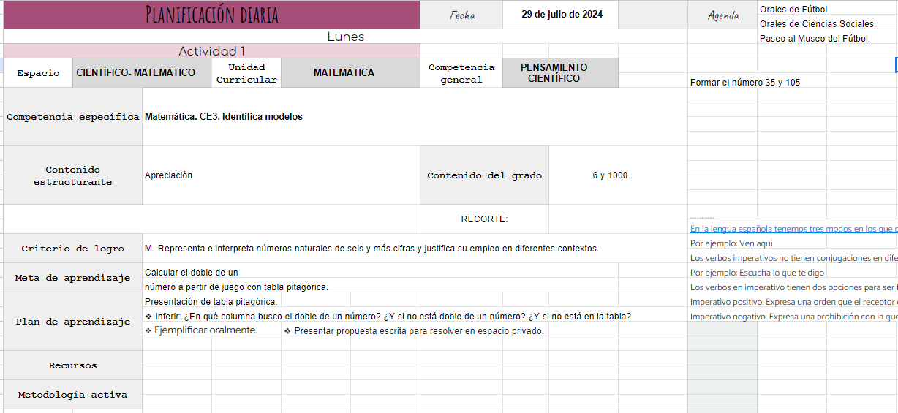

# Entrevistas

_**Aclaración**: Las maestras de esta institución solicitaron no filtrar su información privada, por lo tanto, solo se nos permitió usar su nombre de pila para el informe._

## Entrevista a maestra 1

### Nelly

#### Perfil:

- Maestra de 3er año.
- Un grupo en la mañana en escuela pública.
- Un grupo en la tarde en escuela privada.
- Edad: Entre 40 y 60 años.

#### Método de planificación:

- Realiza la planificación en papel y luego la transcribe en la laptop a un documento de Drive que compró en internet.
- Planificación semanal, a veces quincenal.

#### Comentarios/Anotaciones:

- En las primeras semanas de clase, realiza un diagnóstico con evaluaciones y actividades para determinar las fortalezas y debilidades del grupo y de los niños en particular.
- Incluye anotaciones sobre niños con capacidades diferentes para adaptar la planificación a sus necesidades.
- Busca material principalmente en libros y consulta con otras maestras.
- Menciona la falta de plantillas o guías proporcionadas por ANEP y expresa la necesidad de una herramienta más accesible y sencilla, que no requiera tanto ir y volver a las guías para agregar criterios de logro o competencias específicas.
- Encuentra difícil e intuitivo manejarse por Drive.
- La validación de su planificación es realizada por la directora ocasionalmente y por la inspectora dos veces al año, subiendo la planificación a una carpeta de Drive donde recibe sugerencias.

#### Material compartido:

- Accedió a compartir material sobre la planificación semanal de un grupo.
  [Ver planificación](./SemanaEscolarNelly.pdf)

## Entrevista a maestra 2

### Fernanda

#### Perfil:

- Maestra de 5to año.
- Un grupo en la mañana en escuela privada.
- Un grupo en la tarde en escuela privada.
- Edad: Entre 40 y 60 años.
- Licenciada en pedagogía.

#### Método de planificación:

- Realiza comentarios sobre la posible planificación en papel y luego la transcribe en la laptop a un Excel que descargó en internet.
- Planificación quincenal.

#### Comentarios/Anotaciones:

- También realiza diagnóstico, pero su prioridad es conocer a los niños más que a su nivel de conocimiento.
- Tiene una agenda donde anota las actividades que tienen para cualquier día de esa semana, como por ejemplo orales o presentaciones de proyectos.
- Incluye anotaciones sobre niños con capacidades diferentes para adaptar la planificación a sus necesidades.
- Busca material principalmente en libros, internet y secuencias compartidas por otras maestras.
- Comenta que el mayor problema es que no hay secuencias predefinidas, por lo tanto, dependen mucho de tener contacto con otras maestras que hayan dado esa clase. Algo importante de las secuencias es que son modificables, no estáticas.
- Menciona que existe falta de comunicación entre el equipo docente en general, de la cual todos podrían beneficiarse.
- Existen proyectos colaborativos entre maestras. Por ejemplo, si ella está dando algo relacionado con la luz, seguramente haya algún grado que también tenga una temática similar paralela a ella. Conociendo esto, puede planificar actividades didácticas intergrupales.
- Hace hincapié en que la inspectora cumple un rol de orientación; puede ayudar a planificar, pero no puede imponerse en la planificación, ya que el docente es el responsable del grado de conocimiento en el que están los niños.

#### Material compartido:

- Accedió a compartir material sobre la planificación de un día de un grupo:
  

- Nos compartió un ejemplo de una secuencia.
  [Ver secuencia](./EjemploSecuencia.pdf)

## Entrevista a maestra 3

### Lucía

#### Perfil:

- Maestra de 1er año.
- Un grupo en la mañana en escuela pública.
- Un grupo en la tarde en escuela privada.
- Edad: Entre 20 y 30 años.

#### Método de planificación:

- Realiza la planificación en el celular o laptop en un documento de Drive que hizo ella misma.
- Generalmente toma notas en el celular de cosas a modificar en la próxima planificación dependiendo del grupo.
- Planificación semanal, a veces quincenal.

#### Comentarios/Anotaciones:

- También realiza diagnóstico de grupo.
- Generalmente pone 3 a 4 criterios de logro por semana.
- Tiene una sección de observaciones donde comenta si llegó o no a dar los temas.
- Busca material principalmente en internet y utiliza herramientas como LiveWorksheets.
- Le gustaría que existiera alguna plantilla que hiciera la planificación más llevadera.
- Le gustaría que se pudieran desplegar las "cosas que son de completar", refiriéndose a criterios de logros y su relación con los objetivos.
- También comparte su planificación con la inspectora/directora mediante Drive.

## Entrevista a maestra 4

### Elena

#### Perfil:

- Maestra de 2do año.
- Un grupo en la tarde en escuela privada.
- Edad: Entre 30 y 40 años.

#### Método de planificación:

- Realiza la planificación en la laptop.
- Planificación semanal.

#### Comentarios/Anotaciones:

- No realiza diagnóstico de grupo; se acopla a ellos a medida que pasan las semanas y hace anotaciones al respecto.
- Tiene un Drive compartido con otras maestras del mismo año donde comparten material y sus plantillas.
- Comenta que no hay un orden particular para dar los temas. Generalmente se adapta al conocimiento del grupo. Si bien hay grandes temas que se deben dar, puede haber grupos más "flojos" en un área, por lo tanto, se trabajaría más en eso.
- Busca material principalmente en internet y consulta a compañeras maestras.
- Generalmente arma presentaciones con los temas.
- Le gustaría tener un checklist de "to-do" para temas que quisiera tratar con ese grupo en particular.
- Cree que sería conveniente tener alguna herramienta para relacionar cosas más rápido. Comenta que la mayoría de las maestras eligen primero el criterio a abordar y luego lo asocian a la competencia específica y el criterio de logro, lo cual consume mucho tiempo. Señala que "de seguro debe haber alguna forma de relacionarlos más rápidamente ya que están especificados por ANEP".
