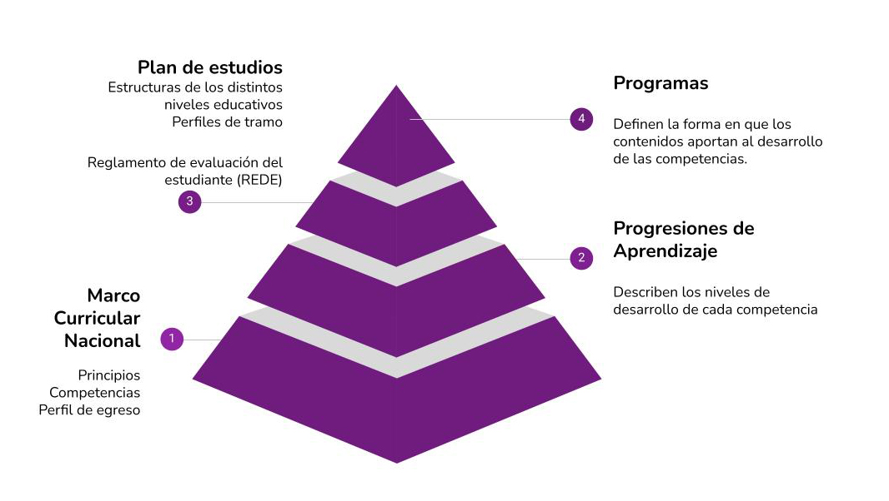
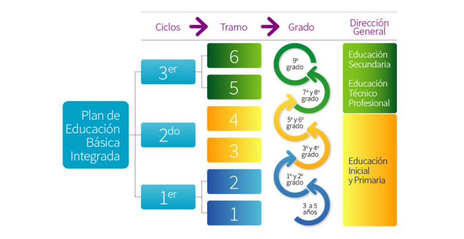
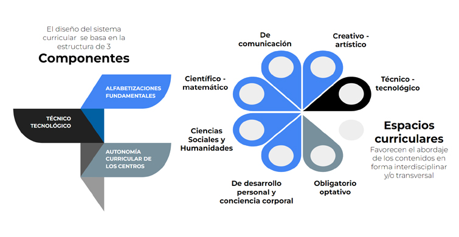
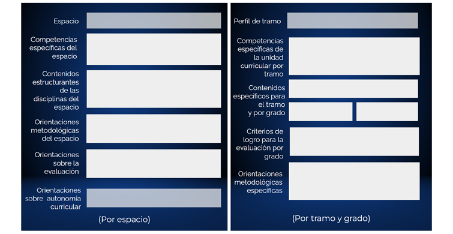

# Programas de Educacion Basica Integrada

Son documentos en los que los docentes se apoyan para elaborar sus propuestas educativas. Presentan los contenidos asociados a las competencias específicas de las unidades curriculares acordes al plan, además de describir cómo estas contribuyen al desarrollo de las diez competencias establecidas en el MCN (Marco Curricular Nacional).

Están diseñados con espacios curriculares integrados por distintos campos que abarcan todo lo necesario para el estudiante de educación básica. Estos también incorporan sugerencias sobre metodologías de enseñanza y orientaciones para los métodos de evaluación.

## Plan de estudios y sistema curricular

El currículo es el espacio en el que se define qué deben aprender los estudiantes, por qué deben aprender eso y qué estrategias se utilizarán para lograrlo.

Una vez que se establece el documento más general del sistema curricular, en el MCN se definen: las Progresiones de Aprendizaje, el Plan de Educación Básica Integrada y los Programas, como documentos "conexos e interrelacionados" que componen el sistema curricular.

El MCN, presenta (entre otros conceptos), los principios de la educación nacional, las diez competencias generales a desarrollar, los perfiles de egreso de la educación obligatoria y los componentes del currículo

Los perfiles de egreso describen los desempeños esperados de los estudiantes al finalizar la educación obligatoria.

Las Progresiones de Aprendizaje (PA) describen el desarrollo de cada competencia hacia los logros expresados en el perfil de egreso. No describen qué enseñar, sino cómo los estudiantes avanzan en sus habilidades en aspectos particulares del desarrollo de cada una de las diez competencias.

El plan de estudio de Educación Básica Integrada propone la organización curricular que fundamenta y articula tres ciclos educativos y en seis tramos compuestos por: tres grados de educación inicial, seis grados de educación primaria y tres de educación media.

El diseño del sistema curricular, se basa en una estructura de 3 componentes principales y 7 espacios curriculares, los cuales buscan favorecer el abordaje de los contenidos de forma interdisciplinar. Este facilita la navegabilidad entre los subsistemas, promueve la continuidad educativa y facilita el
desarrollo de las competencias de los estudiantes

## Estructura de los programas

Los programas están divididos en dos partes principales: una que trata temas generales del espacio curricular y otra que detalla aspectos específicos de cada unidad curricular para cada grado y tramo.

Cada espacio curricular se organiza en unidades curriculares relacionadas. Las unidades curriculares son como bloques básicos en un plan de estudio, y pueden tener diferentes formas. Se encargan de organizar la enseñanza, el aprendizaje y la evaluación. Al trabajar en estas unidades, se desarrollan las competencias específicas, que conectan el pensamiento con conocimientos concretos. Estas competencias reflejan lo que los estudiantes deben saber y hacer en cada área.

Los contenidos estructurantes, que son los temas clave de cada campo del saber, son esenciales en las unidades curriculares. Son la base sobre la cual se construye todo el aprendizaje. Los contenidos específicos se eligen por su capacidad para desarrollar las competencias y activar los procesos de pensamiento necesarios.

Los programas incluyen criterios de logro por tramo y grado. Estos son indicadores claros de lo que se espera que los estudiantes logren y demuestren a través de su trabajo. Sirven para evaluar el nivel de desarrollo de las competencias y ayudan a los estudiantes a saber qué se espera de ellos.

### REFERENCIA

    https://www.anep.edu.uy/programas-ebi-2023-2023
