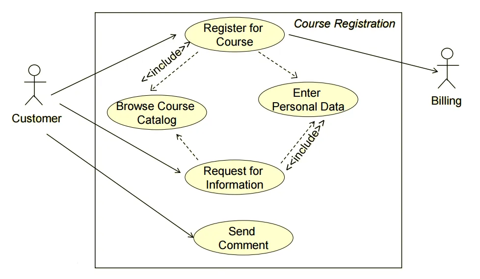
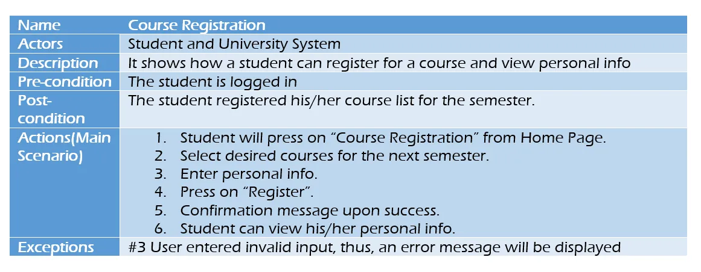

# Investigacion de requerimientos

## Descubrimiento de requisitos

Es el proceso de interactuar con las partes interesadas y recopilar sus requisitos sobre el sistema requerido y el sistema existente (si existe).
Se puede realizar utilizando algunas técnicas, como entrevistas, escenarios, prototipos, etc., que ayuden a los accionistas a comprender cómo será el sistema.

## Entrevistas

En las entrevistas, los equipos de ingeniería de requisitos plantean preguntas a las partes interesadas sobre el sistema que se utiliza actualmente y el sistema que se desarrollará, y así pueden recopilar los requisitos a partir de las respuestas.

Las preguntas se dividen en dos categorías:

Preguntas cerradas : Un conjunto de preguntas predefinidas.
Preguntas abiertas : No existe una respuesta esperada predefinida, son preguntas más genéricas. Se utilizan para explorar cuestiones que no están claras de una manera menos estructurada.

Las entrevistas son útiles para obtener una comprensión general de lo que necesitan las partes interesadas, cómo podrían interactuar con el nuevo sistema y las dificultades que enfrentan con el sistema actual.

Sin embargo, las entrevistas no son tan útiles para comprender los requisitos del dominio. Esto se debe a dos razones:

Los requisitos del dominio se pueden expresar utilizando terminologías de dominio especiales, y los ingenieros de software a menudo encuentran difícil comprenderlos y es fácil que los malinterpreten.
A veces, las partes interesadas no le informarán sobre algunos requisitos porque suponen que son muy fundamentales y no vale la pena mencionarlos, o les resulta difícil explicarlos y no se tendrán en cuenta en los requisitos.

## Casos de uso y escenarios

El caso de uso implica algunos símbolos para describir el sistema:

Símbolos del diagrama de casos de uso y un ejemplo
Actores : Son aquellos que interactúan con el sistema; humanos u otros sistemas.
Interacción (caso de uso) : indica el nombre de la interacción (verbo). Se representa como una elipse con nombre.
Conexión : Líneas que vinculan a los actores y las interacciones.
Relación de inclusión : indica una conexión entre dos interacciones cuando una interacción es invocada por otra. Por ejemplo, dividir una interacción grande en varias interacciones.
Relación de exclusión : denota una conexión entre dos interacciones cuando desea ampliar una interacción agregando un comportamiento opcional, pero puede usar la interacción principal por sí sola sin la interacción de extensión.

Ejemplo de uso:

Los casos de uso y los escenarios son técnicas eficaces para obtener los requisitos, pero, como se centran en las interacciones con el sistema, no son eficaces para obtener requisitos empresariales, no funcionales o de dominio de alto nivel.

## Clasificación y organización de los requisitos

Es muy importante organizar la estructura general del sistema.

Reunimos los requisitos relacionados y descomponemos el sistema en subcomponentes de requisitos relacionados. Luego, definimos la relación entre estos componentes.

Lo que hagamos aquí nos ayudará en la decisión de identificar los patrones de diseño arquitectónico más adecuados.

## Priorización y negociación de requisitos

Ya explicamos anteriormente por qué obtener y comprender los requisitos no es un proceso fácil.

Esta actividad se ocupa de priorizar los requisitos y encontrar y resolver conflictos de requisitos a través de negociaciones hasta llegar a una situación en la que algunas de las partes interesadas puedan llegar a un acuerdo.

### Referencia:

Ingeniería de software, 9.ª edición, Capítulo 4
